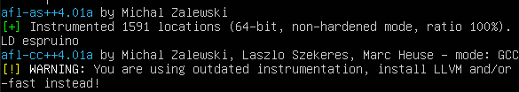
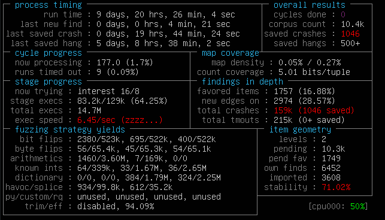

# 🏌️ BGGP3 - How to crash a famous JS engine for fun


So this summer - and it has been this for the past 2 years - the famous [Binary Golfing Grand Prix](https://tmpout.sh/bggp/3/) took place online for it's 3rd edition, and of course I decided to give it a try.

After getting to try my best at golfing binaries ([see my golfing posts](/tags/golf/)), I had to race this competition for fun and learn a lot about fuzzing.

## What is fuzzing?

Fuzzing a binary is like bruteforcing a binary's input (cmd args, input file...) in order to get an odd behaviour, a bug or even the holy crash.

There are a lot of tools in order to help users to fuzz a binary and optimize the results (execs/s, payload mutation, harnesses...) and they are pretty easy to use.

The first tutorials online and my own knowledge led me to the famous `AFL`, or more exactly it's big brother `AFL++`. So I will go with this tool for this grand prix in order to familiarize myself with it.

## Chosing target


If you want to follow my journey in the real events timeline, [click here](#struggles-or-real-history).


Looking by curiosity what are all the known JavaScript engines (and there are a lot of them), one caught my attention: [Espruino](https://github.com/espruino/espruino).

I thought this project was in the spirit of the minimalism, and thus wanted to see if it was enough to avoid crashes.

Especialy design for embeeded devices and IoT, still maintained after more than 7 years, this project was a good practice for fuzzing.

## Instrumentation


For this fuzzing project, I used the AFL++ Docker container, mapping the code of the target in `/src`.


The first step for fuzzing, we have to prepare the target binary. ALF uses a custom GCC in order to optimize results and explore the binary. We have to build the binary from source and patch the Makefile.

```diff
--- a/Makefile
+++ b/Makefile
@@ -1,8 +1,12 @@
- CC = gcc
+ CC = afl-gcc
```

In more complex project, you will have to also change the compiler to `alf-clang-fast++`, add some compilation flags for optimizations, and even have to patch the `main() {}` function for AFL.

On compilation you should see some warnings/infos from AFL:



I will copy the built binary in `/usr/local/bin/`, and create a new directory for this fuzzing:

```bash
cd $HOME
mkdir in # our inputs for the fuzzer
mkdir out # outputs of the fuzzer (crashes, test queue...)
```

## Minimizing test cases

The next step is to get good test cases to speed up the process of fuzzing. The fuzzer will base its mutations on those test cases, so the more unique tests you have, the better.

By chance, most projects have good tests in their `/tests/` directory, so let's copy them to our inputs:

```bash
cp /src/tests/*.js in/
```

Once again, for optimizations, it is a good practice to minimize the test cases, it can same a lot of time during fuzz.

```bash
mkdir min # our minimized inputs
afl-cmin -i in -o min -- $TARGET @@ # minify the tests for the target
# the '@@' stands for the input file
# ie. for the target /bin/cat, we would use:
# afl-cmin -i in -o min -- /bin/cat @@
```

After running the command (this will take a while if you have hundreds of cases) we now have a lot more efficient test cases in our `min` dir.

## Fuzzing

Now that we have our test cases ready, let's get to fuzing!

As simple as that:

```bash
afl-fuzz -i min -o out -- $TARGET @@
```

We can also add the `-D` options for mutating random bytes in the payload, and it is recommanded for better results, despite of increasing by a lot the time of fuzzing.


You can multithread AFL:

```bash
# create a master process
afl-fuzz -M name1 -- $TARGET @@
# create a slave
afl-fuzz -S name2 -- $TARGET @@
```

The processes will communicate together and trade their payloads.


## Getting a crash

Within a few minutes I got a crash on the binary with fuzzing, and I got hundreds the first day, pretty nice.

The first crashes were "only" some SEGFAULT, and the files were also already a bit tiny: **79 bytes for a crash**.

So my first crash was due to the following file (base64):

```base64
ZnVuY3Rpb64gZigpIHsKfQoKYSA9IFsKICB2b2lkIDAsCiAgdm9pZCBmLAogIHZvaWQgZigpCl07
CgpyZXN1bHQgPSBhID09ICIsLCI7Cg==
```

Which gives:

```js
functio f() {
}

a = [
  void 0,
  void f,
  void f()
];

result = a == ",,";
```

This code crashes Espruino with no error message, only a SEGFAULT. My guess here was that the parsing code had an issue with the `functio f() {}` part, and crashes the program, maybe a lexer issue due to invalid token?


After some time I managed to minimize the payload down to **4 bytes**: `da5sCg==` or in hex `75ae 6c0a`. So I have here a 4-bytes SEGFAULT.


I also got one buffer overflow of 1.5kB but I never managed to reproduce it on any other system, I concluded that this was a glitch in the matrix and cried a lot, because usualy you only get SEGFAULT or SIG_ABORT crashes, a BoF would have been the cherry on top.

But I got a lot of crashes tho:



(Don't mind the low amount of exec/s here, the first day I got ~100 exec/s but with time it decreased due to the size of the payloads in the corpus)

## Bonus points

With only 4 bytes there was only a few bytes of improvement possible, so I decided to dig into the bug. Too bad that this caused only a SEGFAULT.

After some time of code analysis, coding, guessing and compiling, I managed to patch the bug in an ugly way, but made a pull request anyways, which was not merged, but instead the developpers made an other patch in order to fix this. So I guess this counts?

[Link of the final patch](https://github.com/espruino/Espruino/commit/4cce3caa21c8ae5b8f7f4441379b65d777aa3164).

## Struggles (or real history)

In this section you will read the truth about my fuzzing journey, how much time it took, my mistakes and so on...

### Act I: shock

The day I started to run for this competition, radareorg released a new version of their radare2 tool. Imagine getting a crash on the latest version of one of your favorite tools 😍 

I started to fuzz like I explained in this post, but after days of fuzzing, all I had was a corpus of 2000 files and 6 hangs, which does not count as crash.

The bad part was also that I only had like 8-12 exec/s, which is very slow. And I had no clues about why and how.

### Act II: denial

It was not my fault, right?

So I decided to switch of target. I went for Python 3.8. After building it, making test cases and min them, a day passed, and I started to fuzz for the night. Nothing after hours, not even a new find. There was a problem somewhere. It must be Python, I was thinking. Of course it was Python the problem, not me.

I switched of target many times, here is what I tried (you can try yourself to fuzz them if you want):

```bash
ls $HOME/fuzz
SimpleNES       nvim    radare2         PcapPlusPlus
dlib            inih    polybar         sql-parser
SameBoy         feh     nasm            python
vim
```

### Act III: anger

After trying dozens of projects to fuzz, I started to be a bit angry, or more precisely frustrated. I was trying to fuzz a binary to get a crash, but I got nothing for the past week. Angry at myself that I couldn't setup a simple fuzzing lab.

### Act IV: bargaining

In order to save myself of myself, I started to try a lot of things, with my newly gained experience in fuzzing, I decided to go back to my original idea: `radare2`.

With that, I also read the manual and all the options for AFL++ in order to get better results, I even asked online for help, of course  DMed me to help. He wasted some time with me, and we supposed that the **low** amount of exec/s was due to the fact that I start `r2` in interactive mode, and the process limit itself to a certain amount of threads, so the time the process kill itself in order to spawn a new one, it limits a lot the number of execs.

He also asked me to try other binaries of the `radare2` suite, even to write a harness for a specific function to fuzz.

### Act V: depression

Even with those tweaks and tries, there were no improvements in my results after 5 days of fuzzing. 😢

I decided to take a break for days.

### Act VI: testing

After my break I wanted to know why I did not have any results with my fuzzing. And for me the obvious reason was an issue of the famous 8th layer of the OSI model: the keyboard-chair interface.

For my previous choices, either it was a bad target, or I did things wrong.

### Act VII: acceptance

The only way forward for me was to find an other target, and see if I get a crash easily.

Now that you have the past history of the project, see the real [fuzzing journey](#chosing-target).

## Conclusion

**Points:**

* 4096 - 4 = 4092
* +1024 for writeup
* +4096 for patch

**Total: `9212`pts**

