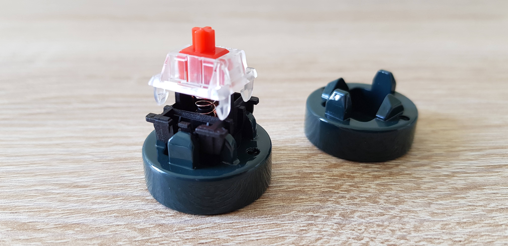
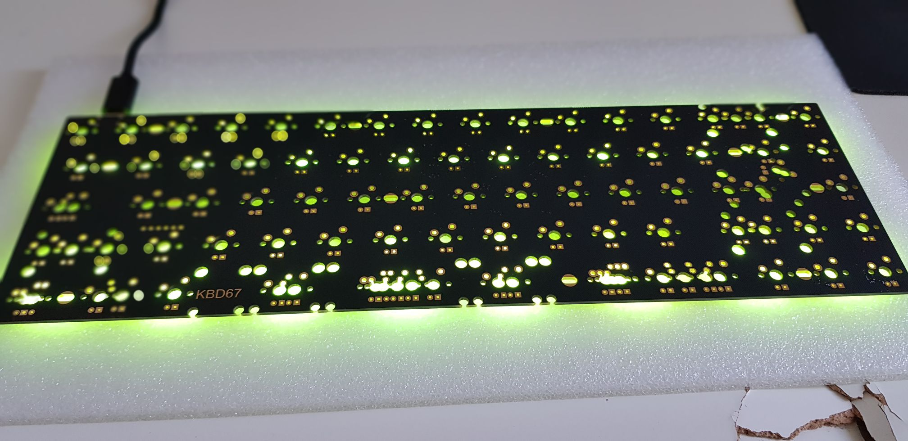

# 🪛 Build your own mechanical keyboard

## Why?

Why not?

## Components

> I bought all the parts on [kbdfans.com](https://kbdfans.com), but you can find a lot of things on other websites. Be careful on the shipping tho!

| Part        | Product     | Comment     |
|-------------|-------------|-------------|
| Switches    | Gateron red | linear, x70 |
| Stabilizers | Cherry Screw-in Stabs 60 set |  |
| PCB         | KBD67 rev2 65% PCB | RGB, VIA support, USB-C |
| Plate       | Aluminium plate |  |
| Backplate   | TADA68 Low Profile Aluminum Case |  |
| Keycaps     | Generic caps |  |
| Lube        | PCMasterrace lube |  |

> Tip: buy a [lube station](https://kbdfans.com/products/kbdfans-lube-tools-collection-1) and a [switch disassembler](https://kbdfans.com/collections/switch-opener) for more confort

## Switches

First thing to do is to disassemble the switches and separate all the pieces for lubing.

**Ref:**



## Test the PCB

We want to test our PCB if any pin is damaged or not working, I used the [VIA software](https://github.com/the-via/releases/releases) to check it.

## Stabilzers

Trim the useless feet of the stabilizers for better stability and less noise.

| Before                     | After                    |
|----------------------------|--------------------------|
|  |  |

Now we will lube the stabs and place them on the PCB.

**Ref:**



## Soldering

We now want to solder the switches to the PCB.

**Ref:**



## Finish

Put the keycaps on it and you got your brand new handmade keyboard.

## Sound testing

> Sorry for bad quality

| Keyboard                     | Sound             |
|------------------------------|-------------------|
| Ducky One 2 (MX brown)       | [mp3](k_duck.mp3) |
| Keychron k3 (MX brown lubed) | [mp3](k_keyc.mp3) |
| Mine (Gatheron red lubed)    | [mp3](k_mine.mp3) |

## Configure keyboard with VIA

[VIA](https://caniusevia.com/) is an open source software to help you configure your keyboard: adding layers (like Fn key), macros and so on.

I used it in order to add a function on my right control key, to unlock a new layer on the keyboard, I can now use F1-F10 keys easily.

