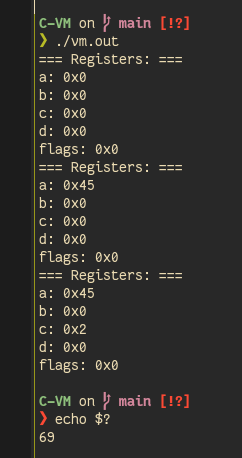

# 🔎 Creating a VM for fun - Part 2: C



This is the second part of my series about creating a custom virtual machine: [part 1 - assembly VM](/assembly-vm).


**The code is here: https://github.com/OxNinja/C-VM**

## Introduction

Doing the PoC in assembly (see part 1) gave me enough information about how to create my own virtual machine, I got the basic concepts for such a subject, such as:

* Parsing opcode
* Emulating instruction
* Use of virtual registers

It also showed me the limitations of this language, I needed a more sofisticated yet low level one, C was the perfect match 🥵.

## Architecture

I came with the following flow for the VM:


graph LR;
    A[Registers init] --> B[Emulate opcode]
    B --> C{Parsing}
    C -->|Good opcode| D[Exec instruction]
    C -->|Unknown opcode| E[Nothing happens]
    D --> F[Loop]
    E --> F[Loop]
    F --> B


## PoC||GTFO

Let's break down how I created this VM.

### Registers

In order to store information such as inputs or outputs, I needed some registers. These must be readable and writeable from anywhere in my program, I needed to make either a ~~forbidden~~ global variable, or create a local one which will be passed to the used functions. I went with the second solution, as it is less dirty, and I wanted to try my best by using pointers and C stuff.

I created a struct for my registers:

```c
typedef struct Registers {
  // common operations registers
  int a, b, c, d;

  // array to work with when manipulating registers' indexes
  // each element will point to the address of the correspponding register
  // see `setup_registers()` for more details
  int *registers[4];

  // flags are stored in one integer, using masks to extract them
  // remainder, zero (cmp)
  int flags;
} Registers;
```

I started to work with only 4 registers `a, b, c, d` and one for the flags after instruction's execution.

I also needed a way to (re)set the said registers to whatever I wanted, so I created this reset function:

```c
/* Set all registers in the array in order to easyliy manupulate them
 * like: regs->registers[2] = 0x2a;
 * is the same as: regs->c = 0x2a;
 */
void setup_registers(Registers *regs) {
  // each element of the array points to the corresponding register's address
  regs->registers[0] = &regs->a;
  regs->registers[1] = &regs->b;
  regs->registers[2] = &regs->c;
  regs->registers[3] = &regs->d;
}

/* Just print the values
 */
void print_registers(Registers *regs) {
  printf("=== Registers: ===\n");
  printf("a: 0x%x\n", regs->a);
  printf("b: 0x%x\n", regs->b);
  printf("c: 0x%x\n", regs->c);
  printf("d: 0x%x\n", regs->d);
  printf("flags: 0x%x\n", regs->flags);
}

/* Force the values of the registers to 0
 */
void reset_registers(Registers *regs) {
  regs->a = 0;
  regs->b = 0;
  regs->c = 0;
  regs->d = 0;
  regs->flags = 0;
}
```

### Emulation

Emulating an instruction is very basic:

1. Parse the input 
2. Detect the corresponding instruction
3. Execute the instruction

But I wanted to do something a bit fancy here: instead of just make a big ~~0x~~`switch` statement, I created a map, or more precisely an array of pointers of functions. Meaning that each entry of the array is a pointer, pointing to the corresponding function to call:

```c
void emulate(Registers *regs, int shellcode) {
  // parsing the input to extract only the opcode
  int opcode = (shellcode & 0xff000000) >> 0x18;

  // instructions is an array of pointers of function
  // each index points to the according function corresponding to the opcode
  // it is very easy to change the opcode for a certain function
  void (*instructions[10])(Registers *, int);
  // no opcode 0 defined for the moment
  instructions[1] = my_mov;
  instructions[2] = my_push;
  instructions[3] = my_add;
  instructions[4] = my_sub;
  instructions[5] = my_jmp;
  instructions[6] = my_cmp;
  instructions[7] = my_call;
  instructions[8] = my_exit;
  instructions[9] = my_pop;

  // code ommited for future spoilers
  redacted();
}
```

Why this "crazy" stuff instead of the good old `switch`? You may ask. Well, for the sake of simplicity, yes, **s i m p l i c i t y**, I used this strategy for a good reason:

```c
// calling the corresponding function only takes 1 line of code,
// and no processing at all: no if, nor loop
(*instructions[opcode])(regs, shellcode);
```

Then each function, such as `my_mov` and so, do the wanted behaviour of the corresponding instruction, for example:

```c
/* Moves the value into the register
 * value is either a register or a plain hex integer
 */
void my_mov(Registers *regs, int shellcode) {
  int is_reg1 = (shellcode & 0x00f00000) >> 0x14;
  if (is_reg1 == 0x1) {
    // get index of target reg
    int target_reg = (shellcode & 0x000f0000) >> 0x10;
    // get value to mov
    int is_reg2 = (shellcode & 0x0000f000) >> 0xc;
    // get moved value
    int value = (shellcode & 0x00000fff);
    // if source is a register and not a value
    if (is_reg2 == 0x1) {
      int source_reg = value >> 0x8;
      value = *regs->registers[source_reg];
    }

    // finally, move the value into the register
    *regs->registers[target_reg] = value;

  } else {
    except("Invalid value for mov (arg a is not a register)");
  }
}
```

Which leads to my next subject: parsing.

### Parsing

Yes, I did not mentionned how my instructions are encoded and how to parse them. See the following scheme to understand my way of crafting one instruction:

| opcode | isReg1 | value1 | isReg2 | value2 |
|:------:|:------:|:------:|:------:|:------:|
|   01   |    1   |    0   |    0   |   045  |

This instruction (`0x1100045`) is a `mov a, 0x45`. Yes this is a bit silly but here is an another scheme in order to better explain my way of encoding my instructions:


graph LR;
    A[opcode] --> B[isReg1]
    B -->|==1| C[value1, index of register]
    B -->|==0| D[value1, plain hex]
    C --> E[isReg2]
    D --> E
    E -->|==1| F[value2, index of register]
    E -->|==0| G[value2, plain hex, left 0-padded]


And here is the size of each portion of the instruction:

* `opcode`: word
* `isReg1`: byte
* `value1`: byte if `isReg1 == 1`, any size else (depends on the instruction)
* `isReg2`: byte
* `value2`: byte if `isReg2 == 1`, any size else (depends on the instruction)

I made the choice to use a constant-sized instruction set, to help me parsing each one, instead of having to hardcode every variant that a variable-length instruction set would require.

Once this logic has been declared, there was one thing left to do: actually parsing the instructions. In fact, as you may have noticed in my instruction functions (`my_mov() my_add()...`), I used binary masking and shifting like so: `(a && 0xff) >> 0x10`.

### Stack implementation

This is propably the most difficult thing in this project for me, as I had to figure out how to implement a virtual stack and related stuff.

I first thought about using a pointer to a `malloc`ed chunck as the stack, where I could store pointers to the values, so here is the struct:

```c
typedef struct Stack {
  // LIFO stack

  // max size of the stack
  int max_size;

  // pointers for the stack
  int *stack, *stack_base, *stack_end, **stack_pointer;
  
} Stack;
```

A few explanations about this propably cursed struct:

* `max_size` is the size of the stack (max number of pointer that could be stored in it).
* `*stack` is a pointer to the allocated chunk in memory to store the pointers.
* `*stack_base` is a pointer to the base of the stack (the first place to store pointers at).
* `*stack_end` is a pointer to the end of the stack (the limit of its size).
* `**stack_pointer` is a pointer of the current "cursor" in the stack, pointing to the stored pointer in it.


flowchart LR
  subgraph Stack
    direction LR
    subgraph *stack
        direction LR
        0x00 --> 0x55ff1111
        0x08 --> 0x55ff2222
        0x10 --> 0x55ff3333
        0x18 --> 0x55ff4444
        ... --> 0x...
        max_size --> ???
    end
    **stack_pointer --> 0x18
    *stack_base --> 0x00
    *stack_3nd --> max_size
  end


Feel free to visit the project's repo to check if I finished this implementation, but by now I am for sure struggling with this.

In fact with this virtual stack the VM is now able to `push` & `pop` and al that stuff, here is how I implemented them:

```c
void my_push(Registers *regs, Stack *stack, int shellcode) {
  // get the value to push
  int value = shellcode & 0x00ffffff;
  // get a pointer to the value
  int *pointer = &value;
  // make the stack pointer pointing to the pointer :brain: :point_right: :point_left:
  *stack->stack_pointer = pointer;
  // increment the cursor for the top of the stack
  stack_inc(stack);
}
```

The same goes for the `pop`, except that we first decrement the stack pointer index, as we incremented it last, and then we store the value pointed into the corresponding register.

## Demo time

I used the following code:

```c
int main(void) {
  // init the struct
  Registers regs;
  // setup the registers' array
  setup_registers(&regs);

  // set everything to 0
  reset_registers(&regs);
  print_registers(&regs);

  // mov a, 0x45
  emulate(&regs, 0x1100045);
  print_registers(&regs);

  // mov c, 0x2
  emulate(&regs, 0x1120002);
  print_registers(&regs);

  // exit(a)
  emulate(&regs, 0x8000000);

  // yes, pointless return but it is for the personnal ethics
  return 0;
}
```



---


Special thanks to:

* [Masterfox](https://github.com/MaitreRenard): for helping me debugging my issues with pointers and structs
* [Nofix](https://nofix.re/): for helping me debugging my array of pointers of functions stuff


