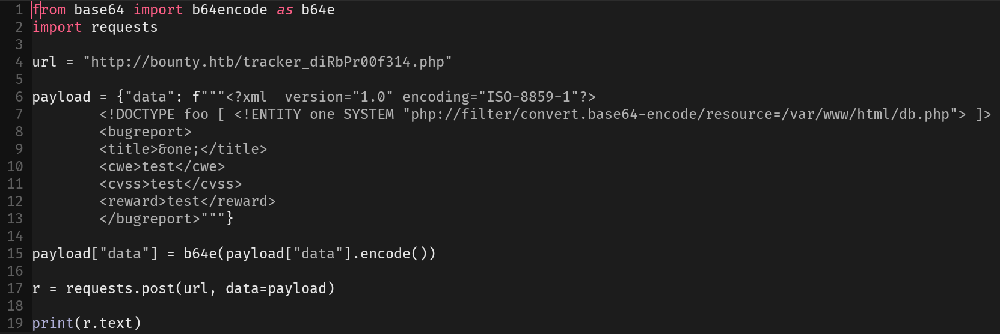
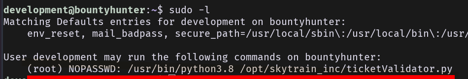
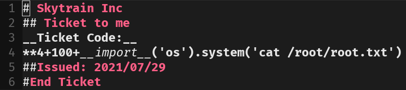
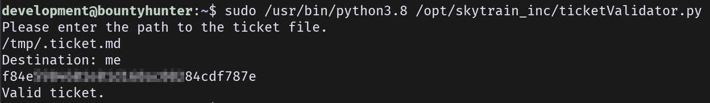
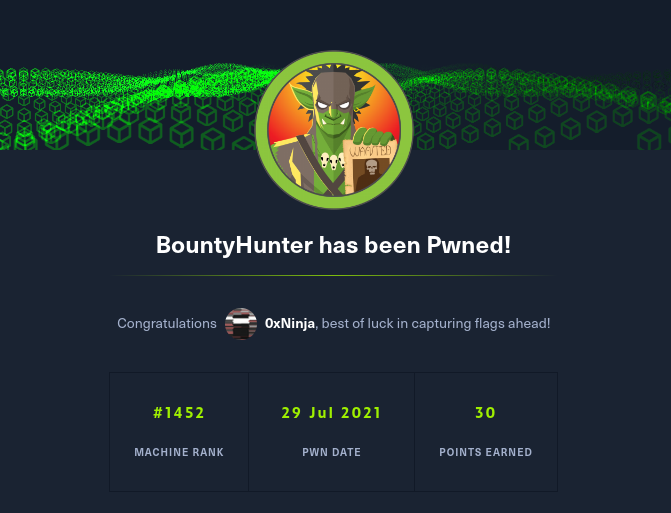

> :warning: writeup wrote months after root so informations are not accurate.

## TL;DR

JS source code disclosure to forge internal requests, leak PHP source code with XXE in custom request, get DB credentials. Privesc with code injection in custom code without input validation.

## Recon

Only HTTP and SSH, nothing special.

## Footholds

We have here a simple web server, with custom SJ script to send bounty tickets. The portal tells us to go to `/log_submit.php`, here we have a custom XHR launched towards an internal API `dirb_pr00f314.php`. We see that XML is posted here so lets try a classic XXE:



We can leak source code with this, here are the files I got: [db.php](db.php).

We get credentials:

```sql
<?php
// TODO -> Implement login system with the database.
$dbserver = "localhost";
$dbname = "bounty";
$dbusername = "admin";
$dbpassword = "m19RoAU0hP41A1sTsq6K";
$testuser = "test";
?>
```

[...]

## Privesc

Basic `sudo -l`:



From that we have a local script to validate tickets: [ticketValidator.py](ticketValidator.py).

Here we see an obvious code injection vulnerability in a custom ticket:



We cat get root:




