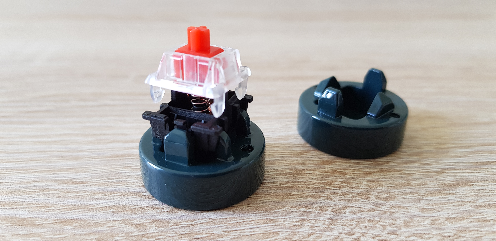
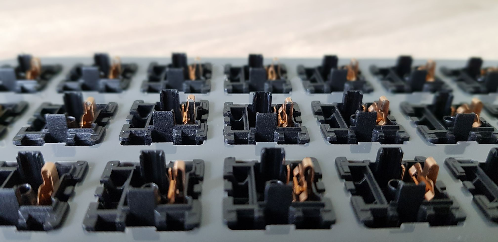
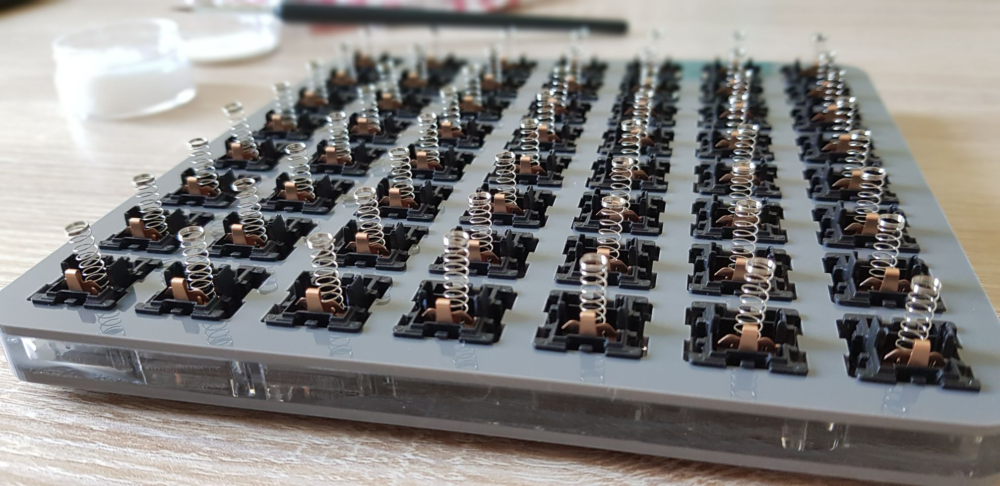
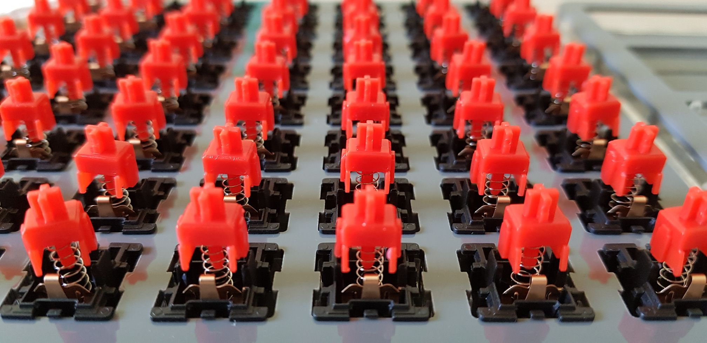
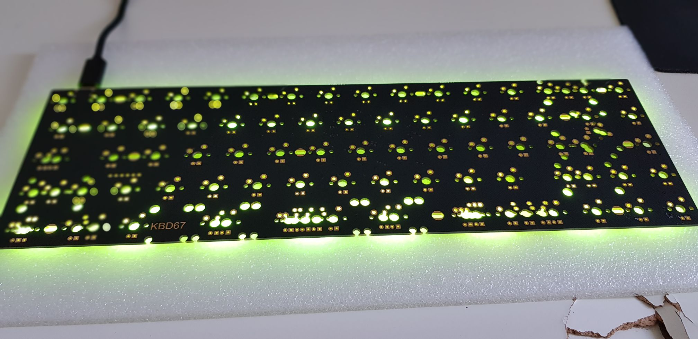
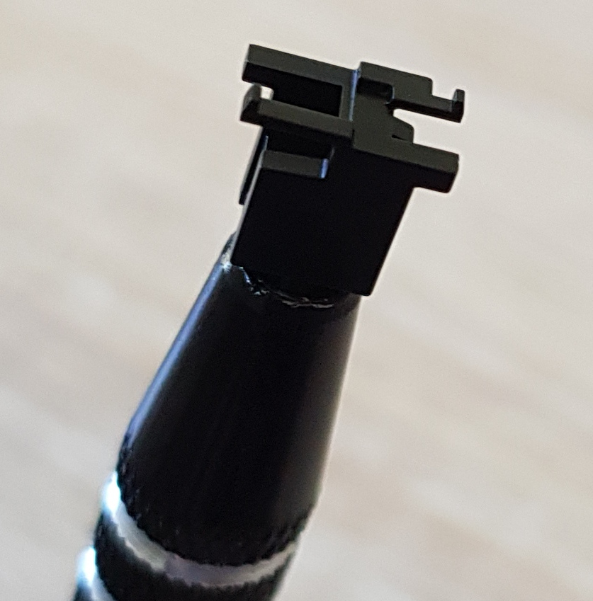
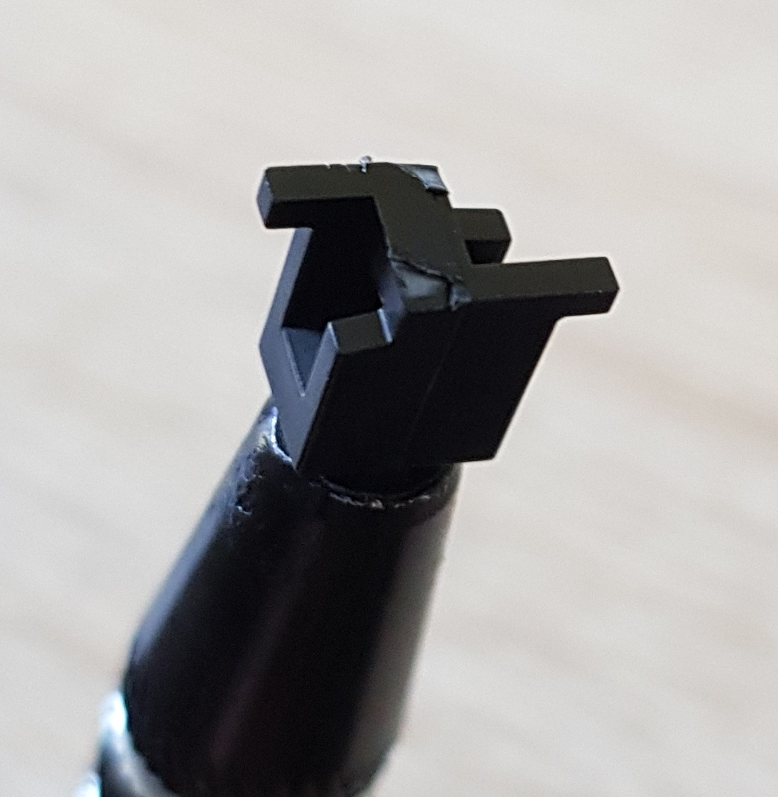
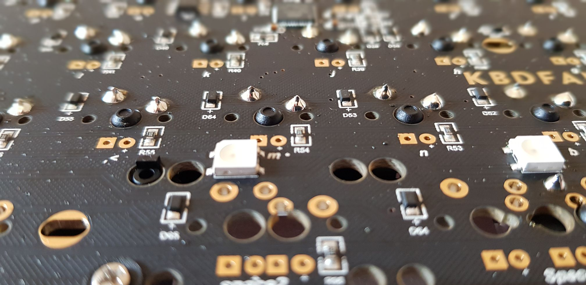
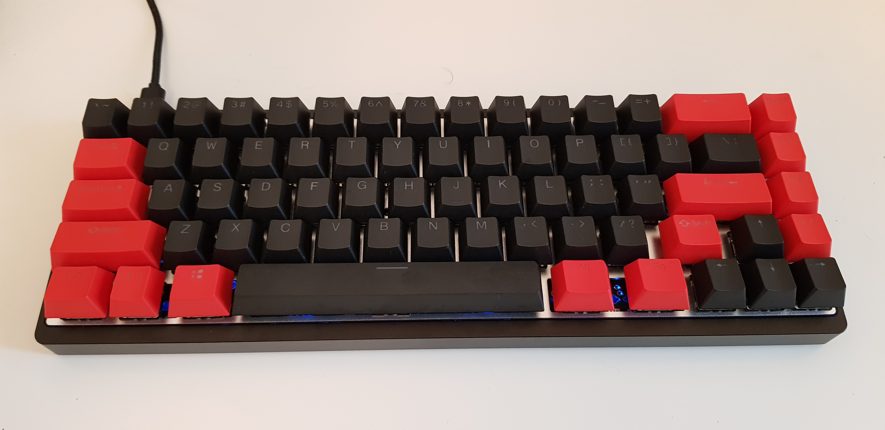

## Why?

Why not?

## Components

> List and link incomming

| Part        | Product      | Comment     |
|-------------|--------------|-------------|
| Switches    | Gatheron red | linear, x70 |
| Stabilizers |  |  |
| PCB         |  |  |
| Plate       |  |  |
| Backplate   |  |  |
| Keycaps     |  |  |
| Lube        |  |  |

> Tip: buy a lube station and a switch disassembler for more confort

## Switches

First thing to do is to disassemble the switches and separate all the pieces for lubing.

**Ref:**



## Test the PCB

We want to test our PCB if any pin is damaged or not working, I used the [VIA software](https://github.com/the-via/releases/releases) to check it.

## Stabilzers

Trim the useless feet of the stabilizers for better stability and less noise.

| Before                     | After                    |
|----------------------------|--------------------------|
|  |  |

Now we will lube the stabs and place them on the PCB.

**Ref:**



## Soldering

We now want to solder the switches to the PCB.

**Ref:**



## Finish

Put the keycaps on it and you got your brand new handmade keyboard.

## Sound testing

> Sorry for bad quality

| Keyboard                     | Sound             |
|------------------------------|-------------------|
| Ducky One 2 (MX brown)       | [mp3](k_duck.mp3) |
| Keychron k3 (MX brown lubed) | [mp3](k_keyc.mp3) |
| Mine (Gatheron red lubed)    | [mp3](k_mine.mp3) |
