Some weeks ago I created a [trainning lab for SQL injections called SQLi lab](https://github.com/OxNinja/SQLi-lab). And I will go through all levels in this blog post, explainning the expected way to solve each of them.


> The lab currently contains **5** levels, and I will update this post as I add more of them 👍

## Installation

The GitHub repository is at [https://github.com/OxNinja/SQLi-lab](https://github.com/OxNinja/SQLi-lab) if you want more information.

First I clone the lab in a folder, add its IP to my hosts file for conveignance, and then build it with the given script:

```bash
git clone https://github.com/OxNinja/SQLi-lab.git
cd SQLi-lab
echo '172.16.0.2 sqli.lab' >> /etc/hosts
./build.sh
```

Let's wait for about 5-10 seconds for the MySQL container to boot, and then visit `http://172.16.0.2`, or `http://sqli.lab`, you should get this:


We can now start level 1!

## Level 1

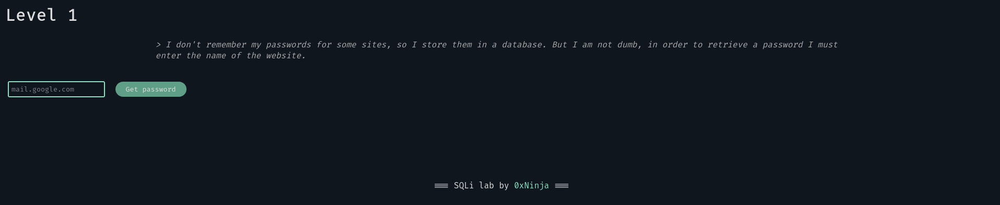

By reading the level's introduction, we know that the admin uses a database with its passwords. We want to get them all, without having to guess the website. But first we need to know how the server works.

By inputing a random website we get:

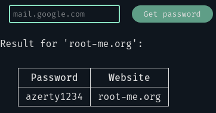

The output is not that verbose, but we might be able to guess the SQL query made:

```sql
SELECT password FROM my_table WHERE website='$website'
```

So let's try a basic injection, like `' or 1=1-- -`:

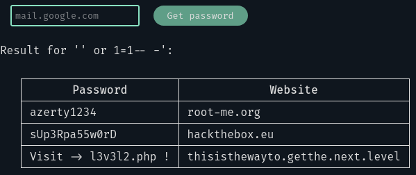

Okay we got him, we have the URL for the next level.

## Level 2

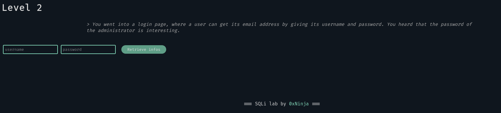

Here we need to retrieve the admin's password. Let's try `admin:admin`:

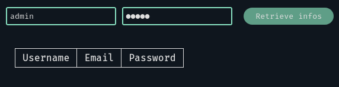

Of course we don't have anything. With the information we have, we can imagine the SQL query:

```sql
SELECT username, mail, password FROM users WHERE username='$username' AND password='$password'
```

We can try again with a basic injection `' or 1=1;-- -`:

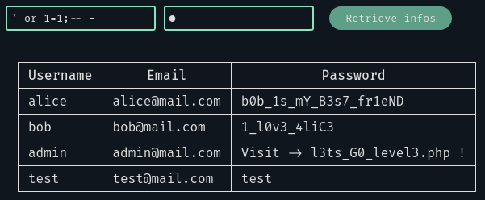

It works fine 😊

We could also have injected the payload in the password field:

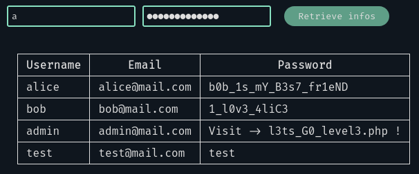

## Level 3

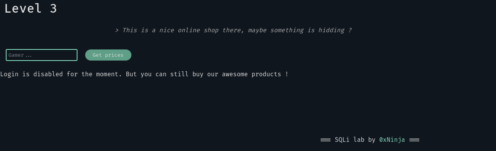

An online shop! We must find what is hidding in there. But first, let's use this product search input:

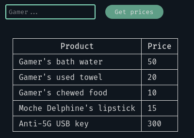

Nothing really interesting 😐

But we see a message on the page: _'Login is disabled for the moment.'_ what is this? Maybe we could see something in the source code?

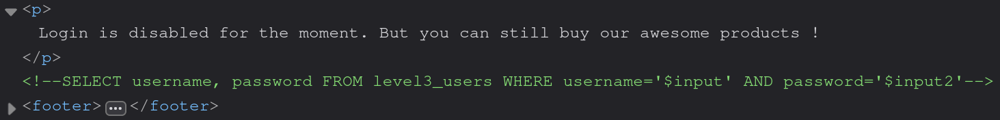

Bingo! We have an SQL query, but how can we use it? The only solution here is to make an UNION-based SQL injection. Let's try it out:

```sql
UNION SELECT * FROM level3_users
```

Should do the trick. Our payload: `' UNION SELECT * FROM leve3_users;-- -`

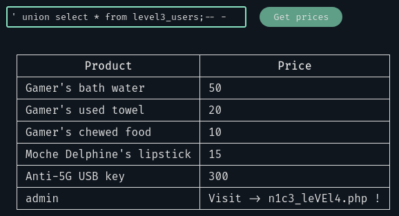

Yes it works! We continue to the fourth level.

## Level 4

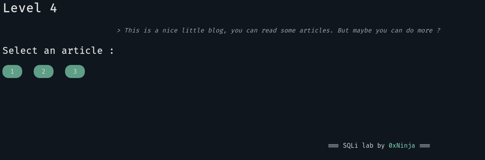

_This level might be harder than the previous ones for some attackers. And it is normal 😈_

The page shows us some buttons we can click to get an article's content:

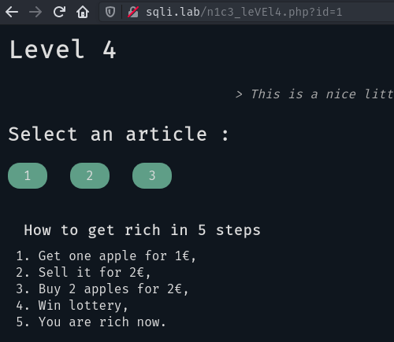

Note the `?id=` parameter in the URL this could help us in the future.

Let's see the generated source code:

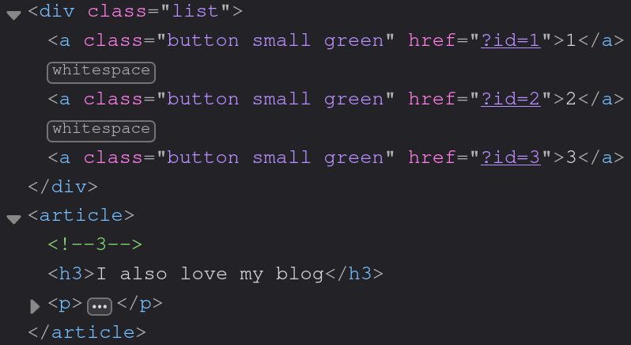

How interesting, the server adds a comment containing the article's id right before its content.

Here we don't have that much information. Our only escape could be -- again -- an UNION-based SQLi. Let's try one:

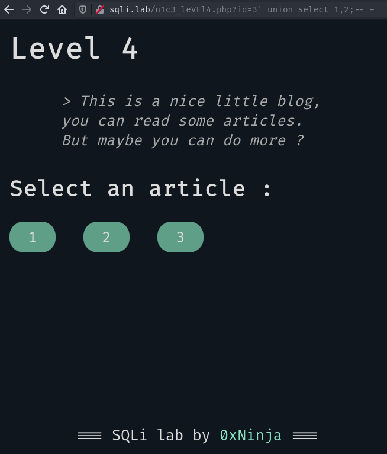

We don't get anything from it, even if we provided an article's id 😕

The right thing to ask is: why? Why do we get nothing with our payload? Why is the article 3 not even rendered?

In an UNION query, both SELECT statements **must** return the same number of columns! So maybe we are wrong, maybe there is not two columns in the server's query. We can figure out the server's query:

```sql
SELECT * FROM articles WHERE id='$id'
```

But how many columns are in there? We can count what we see on the page: the title and the content of the article... AND the id! Those are three columns. Let's try with three columns:

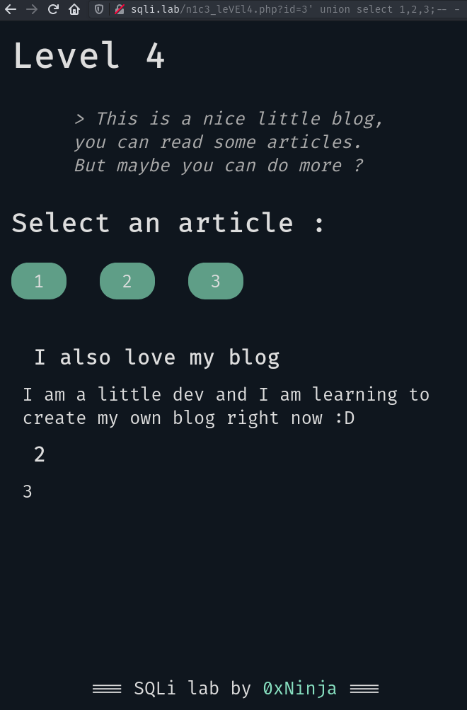

We now have a second article rendered on the page! We can try to customize our payload to select strings or values:

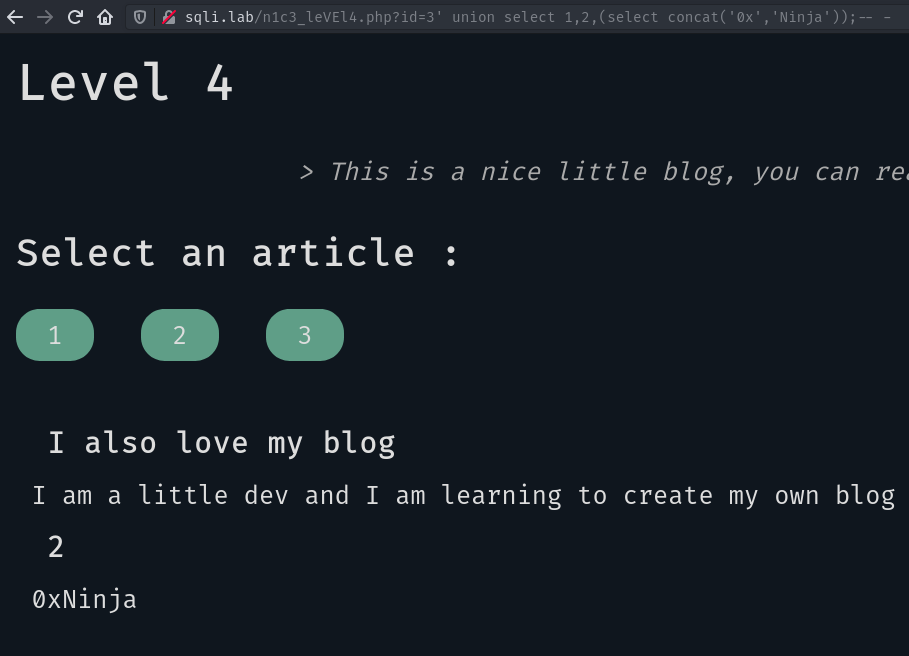

Nice it works as we want! We now want to know the database's name:

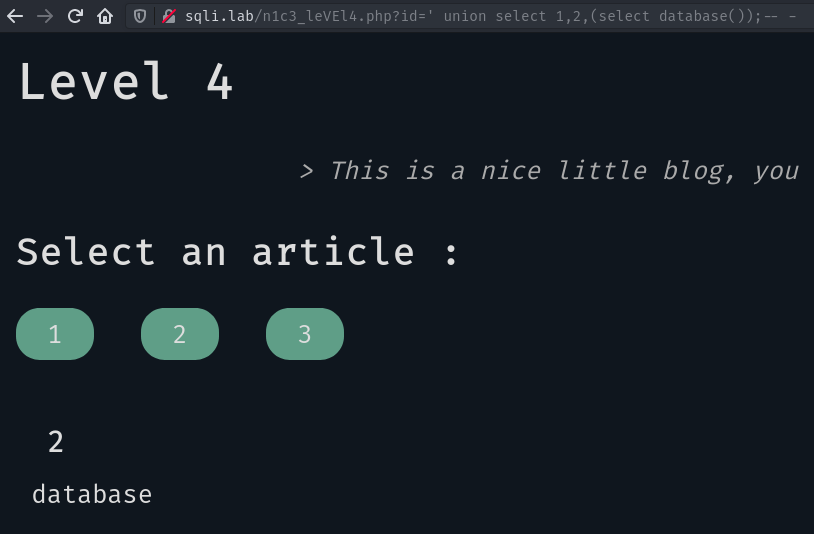

OK, now we want to know the tables of the database:

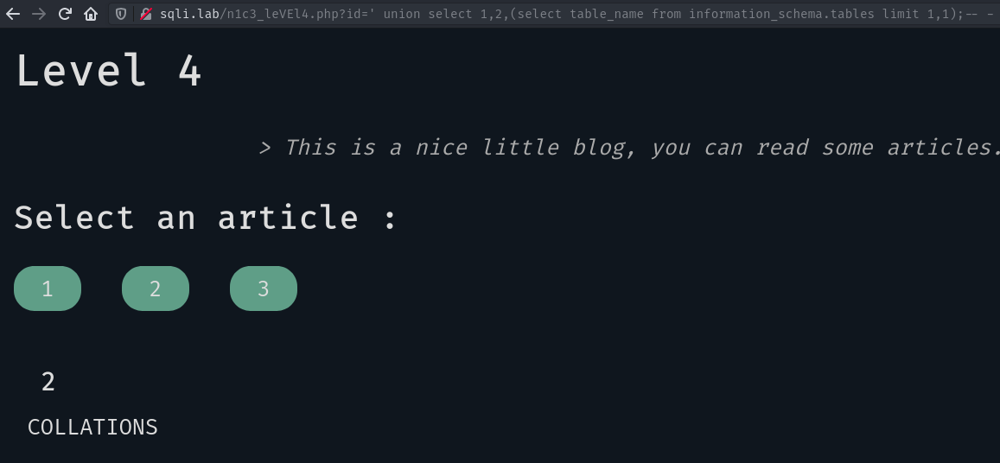

Note the `limit 1,1` at the end, we need it in order to retrieve one by one. Otherwise the UNION query will get an error because we want to SELECT more elements than the first statement.

Here we get the table `COLLATIONS`, which is part of the MySQL's server by default. We only want the tables from our database `database`:

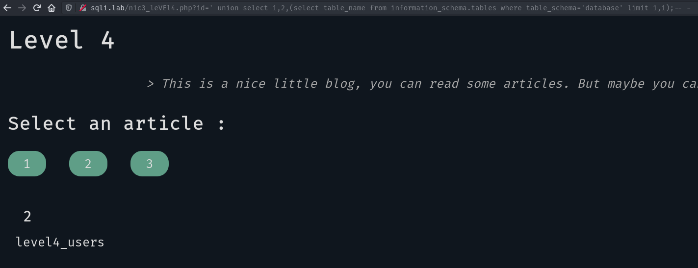

OK now we want to get the columns of this table:

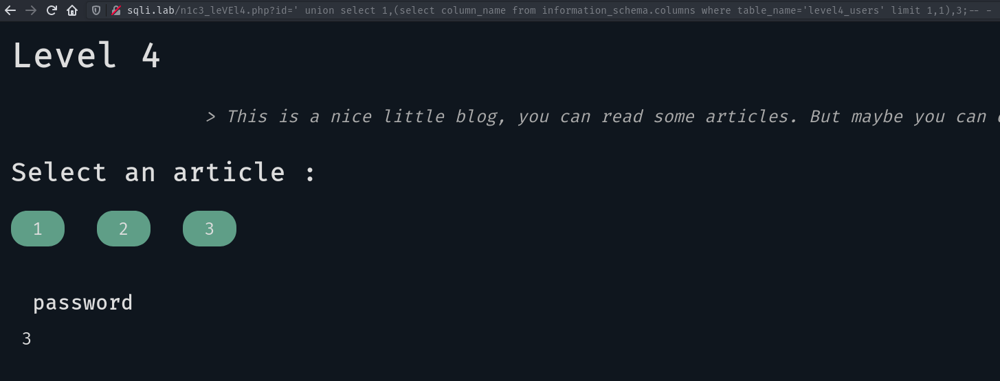

Continuing like this we get the database's schema:

```sql
CREATE DATABASE database;

CREATE TABLE level4_articles (id int, title text, content text);
CREATE TABLE level4_users (username text, password text);
```

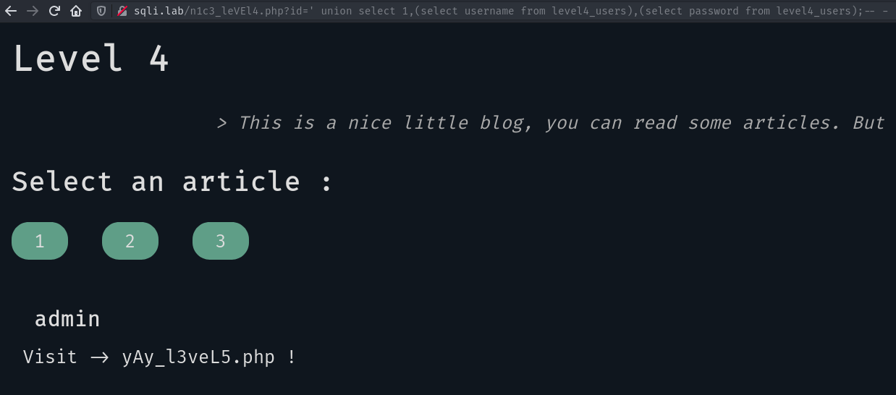

## Level 5

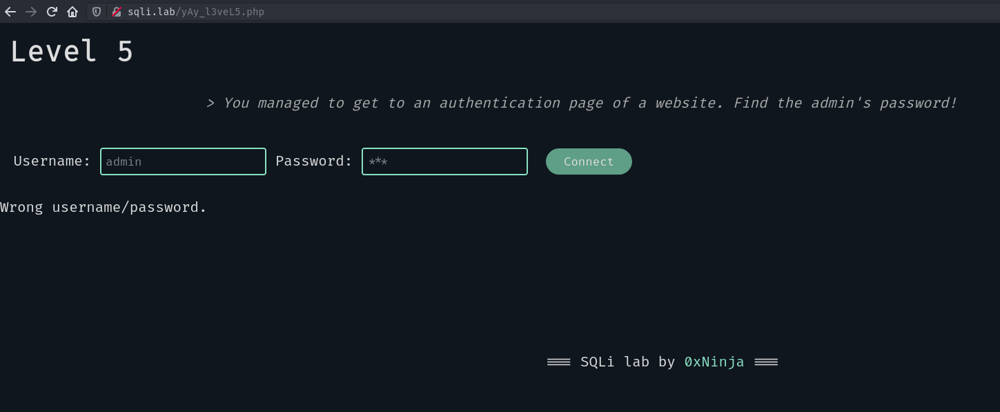

We want to find the admin's password. Let's try the basic `admin:admin`:

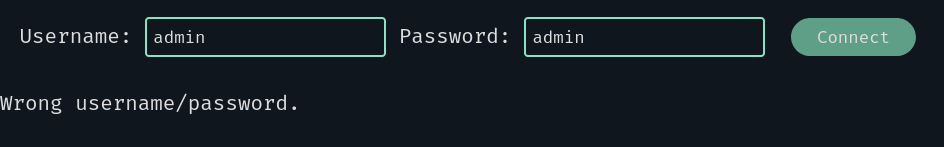

Of course we got a "Wrong username/password" message. Maybe we can try a basic SQLi?

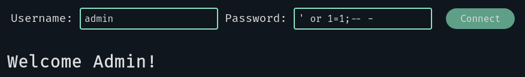

Nice, the server think we are admin! But the goal here is to find the password, not to log as him.

We now know that this form is vulnerable to SQL injections, and when we are logged as the admin we have a "Welcome admin" message. Maybe we can try a blind injection like so:

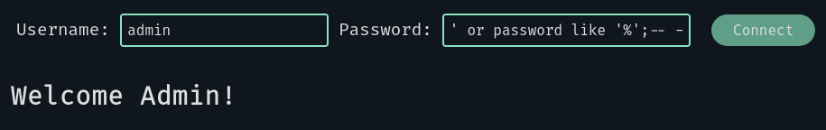

Better! we transformed the query:

```sql
# From:
SELECT * FROM users WHERE username='$username' AND password='$password'
# To:
SELECT * FROM users WHERE username='admin' AND password='' OR password LIKE '%';-- -'
```

Which can lead us to the admin's password! Let's continue like so:

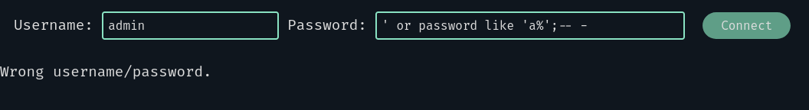

We now know that the first character of the password is not "a". Great! Moving on by changing the letter each time we get the first letter: "f"

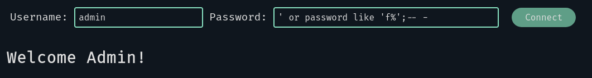

We now have a method to find the whole password, so I will skip to the end untill the final check:

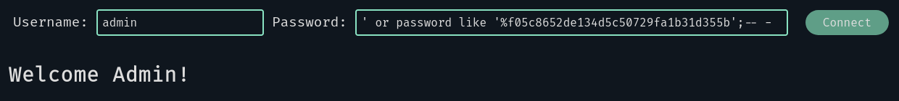

After this point, no matter what the next character is, we get the "Wrong username/password" message. This means that we reached the end of the password, let's check it out:

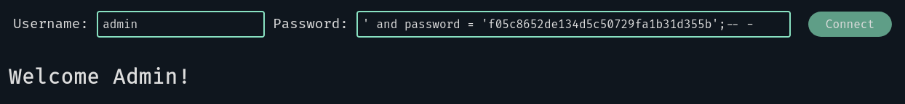

Great! We know the admin's password now. To continue we have to get to the page `/f05c8652de134d5c50729fa1b31d355b.php`.

On this page we are redirected to `/win.php`, meanning we got to the end of the lab.

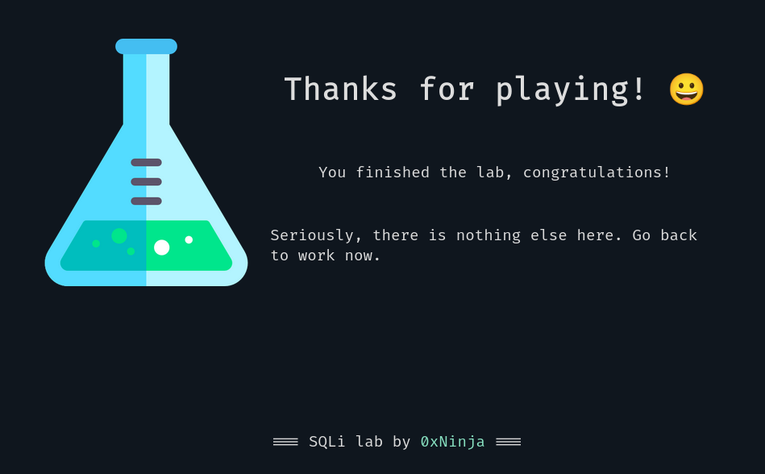

We just finished the last level of this lab! It was fun, wasn't it?


