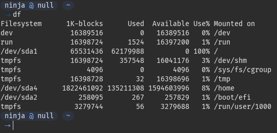
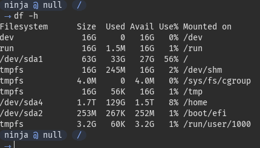
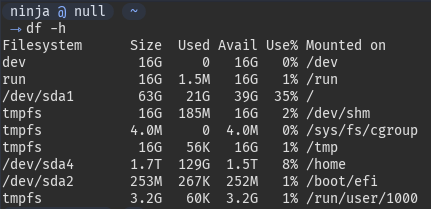

# Free space on disk for Linux distros


Recently I wanted to run a MySQL Docker container and encountered a tragical error:

```
simple_db | 2021-03-25 10:54:04+00:00 [Note] [Entrypoint]: Switching to dedicated user 'mysql'
simple_db | 2021-03-25 10:54:04+00:00 [Note] [Entrypoint]: Entrypoint script for MySQL Server 5.7.31-1debian10 started.
simple_db | 2021-03-25 10:54:04+00:00 [Note] [Entrypoint]: Initializing database files
simple_db | 2021-03-25T10:54:04.578298Z 0 [Warning] TIMESTAMP with implicit DEFAULT value is deprecated. Please use --explicit_defaults_for_timestamp server option (see documentation for more details).
simple_db | 2021-03-25T10:54:04.580054Z 0 [ERROR] --initialize specified but the data directory has files in it. Aborting.
simple_db | 2021-03-25T10:54:04.580073Z 0 [ERROR] Aborting
simple_db | simple_db exited with code 1
```

I was really surprised while reading this one, because the container was working well minutes before. After reading the documentation, and searching on the web for more info, nothing worked for me: the container would not run.

I decided to check for docker-compose updates with my package manager, and guess what? No more space on my root partition 😫

Everybody who played around with Linux distro had one day this view:



How to free disk space on Linux? I will try to show a couple of ways I managed to free space on my root partition.

## Package manager cache

> As I am running on Archlinux, my package manager might be different as yours (ie. I use `pacman` and not `apt` so be carefull).

The first thing I did was to clear my pacman cache, because I knew it would free some space for sure:

```bash
sudo pacman -Scc
```

You can check this blog post which explains how to deal with pacman cache: [](https://ostechnix.com/recommended-way-clean-package-cache-arch-linux/)

With that I cleared almost 30G of data on my disk:



## Docker

Yeah, freeing 30G is pretty satisfying, but imagine freeing more. Joking. But imagine anyway.

I use Docker a lot, especially while working for school projects or CTFs, so I thought about checking my images and trying to free some more space.

After running `sudo docker images` I realized I needed to clean those. I mean, there was like 100 images that I do not use anymore (yes, InterIUT challenges, I talk about you 🥲 ).

```bash
sudo docker images prune
```

This freed 2G on the disk, I was happy about that, but I saw that Docker was still taking too much space here, like 15G could be saved. I realized that Docker volumes where still there, and I decided to remove them.

```bash
sudo docker volume prune
```

Leading me with a total of 40G freed in minutes!



## Sort disk usage

While troubleshouting my disk usage, I used this command to sort by usage:

```bash
sudo du / -x -d 1 | sort -n
```

You can then investigate which directory is taking most usage on your disk.


