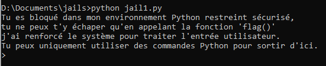
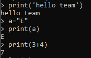

# Les pyjails pour les débutants


## Introduction

Tout d'abord qu'est-ce qu'une 'pyjail' ? Il s'agit le plus souvent d'un environnement Python 🐍 restreint, c'est-à-dire que (comme pour les autres types de 'jails') certaines fonctions, classes ont été supprimées, ou sont filtrées lors du traitement de l'input utilisateur pour bloquer l'attaquant.

Ces environnements restreints sont présents lors de CTFs mais c'est une catégorie qui nécessite un peu de connaissances avant de s'y lancer, mais sont aussi utilisés dans des milieux professionnels afin d'éviter de donner l'accès à tout le système si un attaquant arrive à entrer sur un serveur SSH par exemple.

## Un peu de pratique

Avec l'aide d'un cobaye pour le test, qui se reconnaîtra, j'ai réalisé quelques pyjails qui permettent de mieux appréhender le langage Python, mais aussi de développer une méthodologie de résolution.

Nous allons voir comment résoudre une jail des plus basiques ensemble, ensuite vous serez libres d’approfondir vos connaissances avec d'autres jails que j'ai réalisé, et si le cœur vous en dit vous pouvez même tenter de flag les jails sur Root-Me 😊.

### Avant de commencer

Vérifiez bien d'avoir Python 3 d'installé sur votre machine, puis téléchargez [cette archive zip](jails.zip) qui contient l'environnement de travail adéquat pour résoudre toutes les jails. Cette archive contient un fichier `flag.txt` qui est lu par toutes les jails lorsque vous avez réussi le challenge, vous devez alors laisser les fichiers `jail*.py` dans le même dossier.

### Pour démarrer

Au préalable, décompressez le fichier zip :

```bash
mkdir jails; unzip jails.zip -d jails/; cd jails
```

Pour lancer une jail de votre choix vous avez simplement à l'exécuter avec Python :

```bash
python3 jail1.py
```

> Note : les jails sont classées par difficulté croissante, on a alors `jail1` plus simple que `jail3`

### Au boulot !

Passons à la réalisation de la jail 1. Le but est de finir le challenge sans lire le code source du fichier, mais si vous êtes bloqué plusieurs heures n'hésitez pas à y jeter un coup d’œil rapide.

#### Premier lançement

Pour nous échapper de cette prison nous allons devoir étudier comment fonctionne le programme. On lance la jail1 :



#### Tests

Effectuons quelques tests afin de déterminer ce que l'on peut faire dans cet environement restreint :



On peut voir que les opérations usuelles (calculs, affichage, variables...) sont autorisées, essayons sd'appeler la méthode `flag()` afin de sortir :


Pas de chance, rien ne se passe, pourtant on voit bien que `flag` est une fonction, on devrait être en mesure de l'apeller, comme pour `print()` par exemple.

Il doit se passer quelque chose entre le moment où l'on entre la commande et l'exécution de cette dernière 😔.

Essayons de déterminer le problème :


#### Résolution

On comprend alors que l'entrée utilisateur est filtrée : si la chaîne `"flag()"` est présente, elle est supprimée. Comment y remédier ?

Il existe une astuce moldave bien connue pour contourner ce filtre, vous connaissez le film *Inception* ? C'est le même principe, sauf que c'est pas dans un rêve mais un shell Python.


En effet, écrire `fflag()lag()`, ou `flag(flag())`, ou toute autre variation permet de contourner le filtre. 🎉🎉


